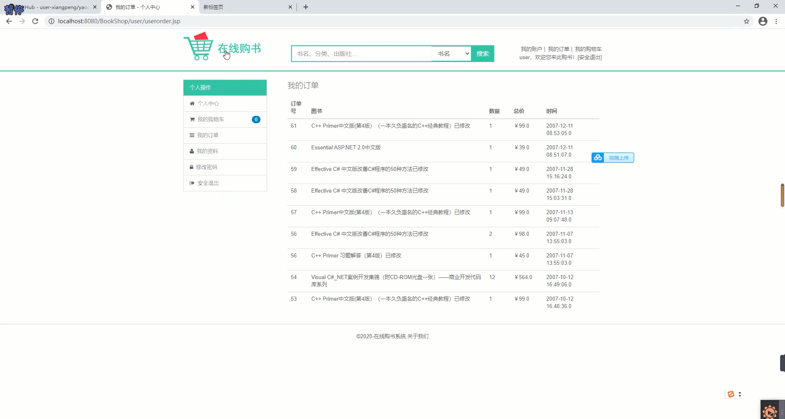
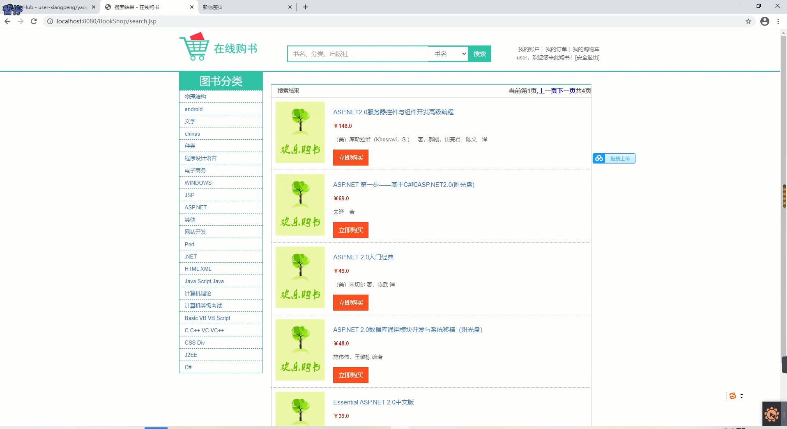
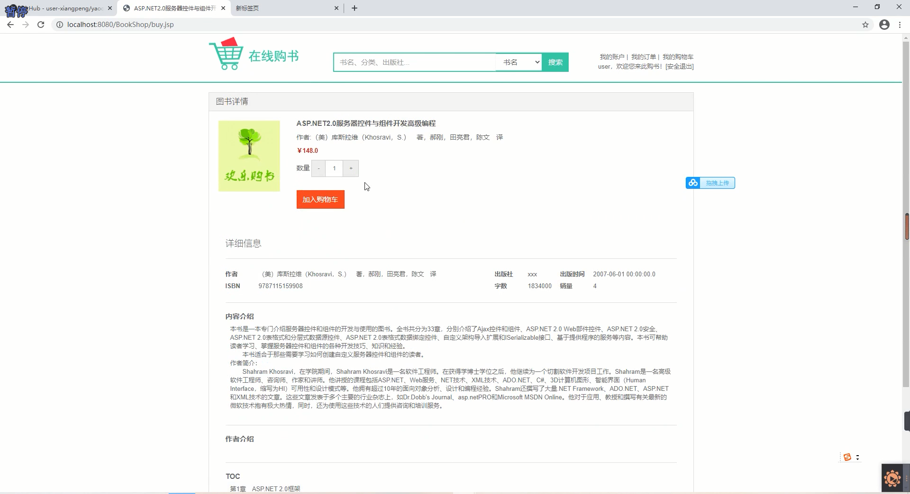
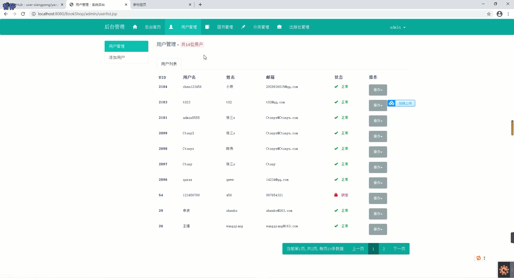
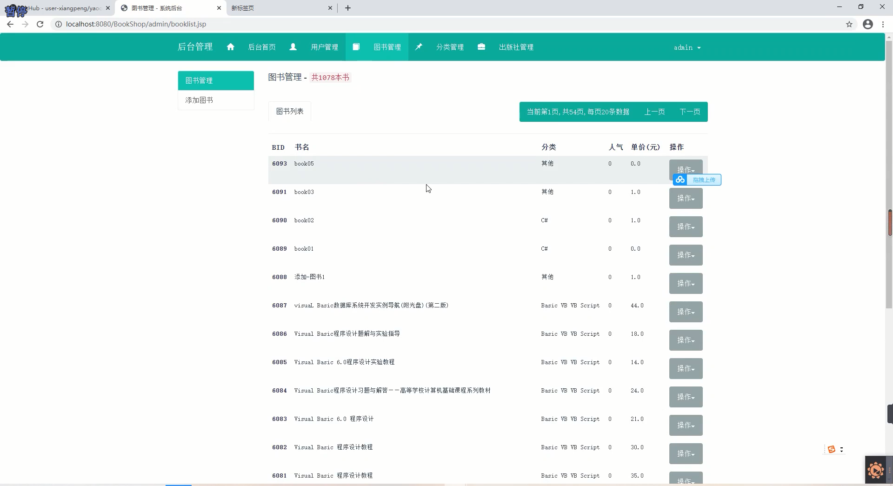
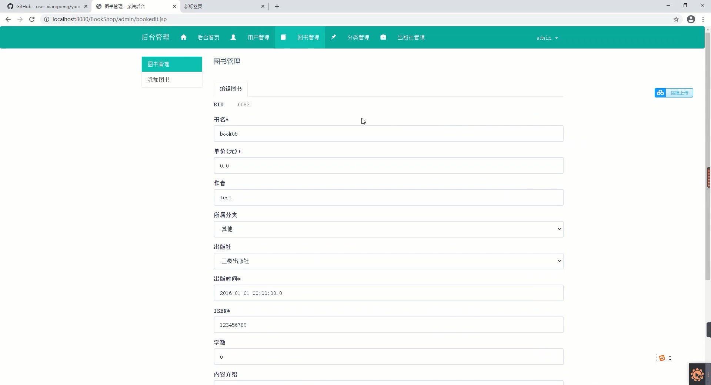
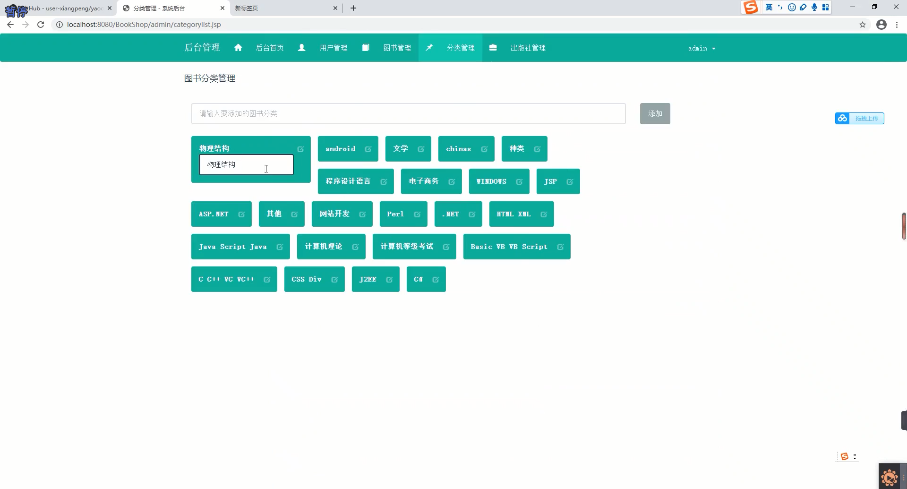

## 基于JSP+Servlet实现的在线购书商城系统

###  获取sql数据库文件: 从戎源码网 (https://armycodes.com/) QQ: 386869957 QQ群: 377586148
###  所有系统地址: (https://github.com/YuLin-Coder/AllProjectCatalog) 
###  所有项目以及源代码本人均调试运行无问题 可支持远程安装部署调试、定制修改、代码讲解

## 项目介绍
基于JSP+Servlet实现的在线购书商城系统，主要功能如下

【用户】功能：
注册和登录：用户可以注册新账号或使用已有账号登录系统。
图书购买：用户可以浏览图书列表，选择图书加入购物车，并进行购买。
购物车管理：用户可以查看购物车中的图书列表，修改图书数量或移除图书。
订单管理：用户可以查看订单列表，包括已完成和未完成的订单，查看订单详情以及取消订单。
个人信息管理：用户可以修改个人信息，包括用户名、密码、联系方式等。
收货地址管理：用户可以添加、修改和删除收货地址，选择默认地址。
支付功能：用户可以选择不同的支付方式进行支付。

【管理员】功能：
注册和登录：管理员可以注册新账号或使用已有账号登录系统。
图书管理：管理员可以添加、修改和删除图书信息，包括图书名称、作者、出版社、价格等。
订单管理：管理员可以查看所有订单列表，包括已完成和未完成的订单，查看订单详情。
用户管理：管理员可以查看用户列表，包括用户的个人信息和订单信息。
分类管理：管理员分类管理各种类别的书籍。

## 项目技术
- 编程语言：Java
- 数据库：MySQL
- 前端技术：JSP、JavaScript、bootstrap、JQuery
- 后端技术：Servlet、JDBC

## 运行环境
- JDK版本：JDK1.8及以上
- 开发工具：IDEA、Ecplise、Myecplise都可以
- 数据库: MySQL5.7及以上

## 运行截图

